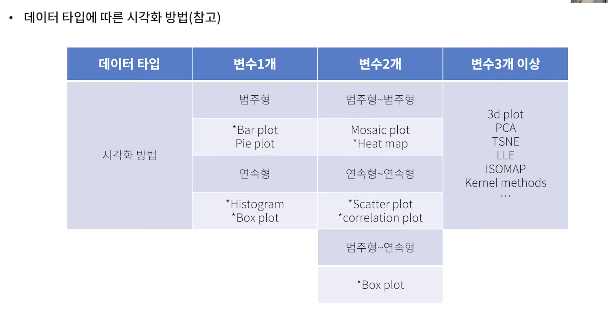
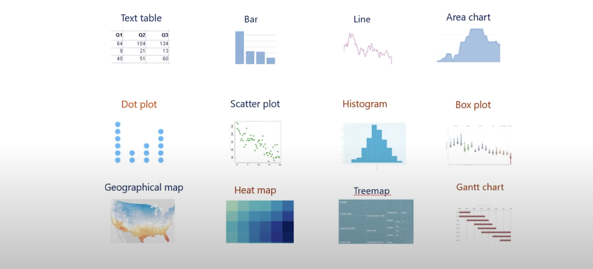

# - 데이터 분석, 시각화, 클리닝, 랭글링

# 데이터의 이해

-   데이터(data): 개체와 (대상의) 속성으로 이루어진 집합.
-   개체(Entity): 관측대상.
-   속성(Attribute): 개체의 특성.

### 데이터의 구분

1. 속성: 연속형, 이산형
2. 구조: 정형, 비정형, 반정형
3. 척도: 정성적(명목형, 순서형), 정량적(구간형, 비율형 )

### 시대별 트랜드

-   데이터 마이닝 -> 빅데이터 -> 머신러닝 -> 인공지능 (기계학습, 딥러닝)

### 데이터 분석이유.

-   데이터 분석: 데이터의 유의미한 정보를 추출하는 과정.

1. 의사결정을 위한 도구.
2. 이미 알고있는 것을 (숫자로) 확실하게 vs 새로운 insight를 도출

### 데이터 분석 프레임워크 (\*\*)

-   Data gather -> Data preprocessing -> Feature selection & Extraction -> Modeling -> Interpretation

1. Data gahter: 데이터 수집, 데이터 저장
2. Data preprocessing: 데이터 전처리, 탐색적 데이터 분석 (Cleaning, wranling, EDA )
3. Feature selection & Extraction: 변수 선택, 특성 추출
4. Modeling: 지도학습, 비지도 학습
5. Interpretation: n 결과평가, 시각화&문서화

## 1. 데이터 클리닝.

-   데이터 품질이 높을 수록 높은 신뢰성을 가짐

### 데이터 품질 평가 요소 4가지.

1. 잡음(Noise): 데이터 수집 혹은 관측 대상에서 왜곡된 값.
    - 대체, 제거, 보류
2. 결측치(Missing value): 측정이나 기록된 값 중 누락된 값.
    - 제거, 대체
        - 방식
        1. KNN 기반 결측치 대체 방법
        2. 다양한 변수를 종합적으로 고려하여 대체
        3. MICE, ML, GAN 기반의 다양한 방식 존재
3. 이상치(Outlier): 다른 관측치 대비 상이한 특성을 가진 데이터

-   의미에 대한 식별 필요.
-   일반적인 지식에 비추어 봤을 때 비정상적인 데이터
    -   box plot 또는 4분위수를 많이 사용한다.
    -   다른 방법으로는 Lof(Local Outlier Factor): 주변 k 개의 밀도를 측정하여 이상치 판정(여러 변수를 고려하여 이상치 판정, cut-off 지정이 필요)
    -   LoF 를 계산하는 수식이 존재하며 cut-off 에 대한 기준은 데이터 분석가가 평가.
        (lrd : Local Researcherbility Density )
        

4. 중복값(Duplicated value): 측정이나 기록 과정에서 중복된 값

### 데이터 품질 개선 프로세스

-   대체 or 제거 후 결과 확인

## 2. 데이터 랭글링 (Data wrangling)

-   분석을 지원하기 위해 데이터를 검색, 정제, 통합, 변환 및 보강하는 프로세스
    (Excel, Tableau, Power BI, Qlik, Sisense, SAP, R, Python)
    

-   데이터 랭글링의 6단계: 아래의 과정이 반복 순환되는 과정

1. 탐색: 데이터 내용 파악
2. 구조화: 데이터 정리, 구조화, 병합
3. 정제: 데이터 품질 확인 후 처리
4. 보완: 추가 데잍 보강 단계
5. 검증: 유효성 검증 및 자동화
6. 배포

-   데이터 핸들링 > 데이터 랭글링 >= 데이터 전처리 > 데이터 매니플레이션
    

tip. 그룹변수를 활용하여 데이터 매니플레이션 진행하는 과정

### EDA: 탐색적 데이터 분석 (자료분석)

-   자료가 무엇을 말하는가.
-   간단한 기술 통계량 계산과 그림으로 나타내는 시각호 방법을 주로 사용

tip. 확증적 데이터 분석 (CDA: Confirmatory Data Analysis )

-   사전에 가설 및 모델 설정
-   수집된 데이터와 모델이 얼마나 잘 일치하는지 평가함
    
-   기술적 통계량
    -   평균, 최대값, 최소값, 최빈값, 표준편차, 분위수, 절사평균, 범위

## 시각화 참고 자료

---

# basic_llm

## 용어정리

1. 머신러닝(기계학습): 경험(데이터)를 통해 자동으로 개선되는 컴퓨터 알고리즘을 총칭함.
2. 딥러닝(심층학습): 여러가지 '비선형 변환기법'의 조합을 이용하는 알고리즘의 집합.
    - 데이터를 통해 Artificial Neurel Network(ANN, 인공신경망)모델을 학습시키는 기법
      
    - black box 가 있기 때문에 확인이 어려움.
3. 강화학습: 에이전트가 현재의 상태를 기반으로 미래의 보상을 최대화하는 행동 순서를 선택하도록 학습시키는 기법.

### 딥러닝의 분야

1. Computer Vison
    - Image/Video Classification
    - Object Detection/Semanitic Segmentation
2. Natural Language Processing
    - Machine Translation
    - Question & Answer
3. Signal Processing
    - Automatic Speech Recognition

### 딥러닝에서 자주 쓰이는 연산

-   Matrix Multification (행렬 곱연산)
-   A Fully Connected Layer

### Tensorflow (Keras 2.x)

-   keras 는 2.x 부터 통합
-   google 에서 개발
-   TPU 지원
-   모바일이나 웹 서빙에서 유리
-   단점: 에러 메시지가 부정확하며, Static Graph 의 방식이며 tf.xx 와 같은 문법을 사용

### Pytorch

-   Meta 에서 개발
-   Dynamic Graph 지원
-   다양한 서드파티 라이브러리 존재(huggingface, timm)

### Tensor Attributes

-   고차원배열
-   numpy 의 array와 비슷한 개념

## MLP
